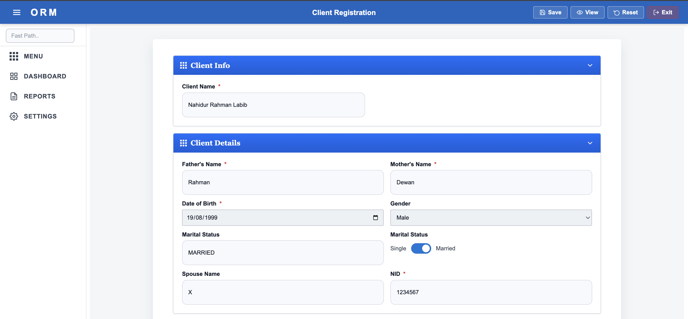
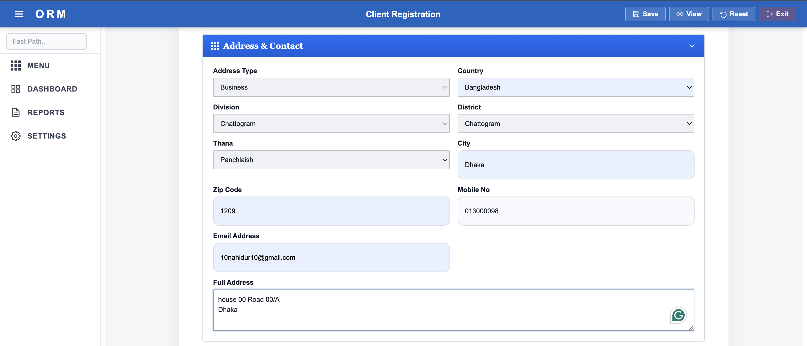

# Enterprise Client Registration Frontend

Angular frontend application for the **Enterprise Client Registration System**. This project provides the user interface for client onboarding and communicates with the Spring Boot backend through REST APIs.

The application was developed using **Angular Reactive Forms** and **Angular Material** with a focus on usability, validation, and modular feature organization.

---

## Features

* Client registration form
* Personal details form
* Address management with cascading dropdowns
* Account creation form
* Form validation with user-friendly error messages
* Angular Material responsive UI
* REST API integration with Spring Boot backend
* Modular Angular structure with reusable components

---

## Technology Stack

* Angular
* TypeScript
* Angular Material
* Reactive Forms
* RxJS
* SCSS
* Angular Router

---

## Project Structure

```text
src/
 ├── app/
 │   ├── client/
 │   ├── address/
 │   ├── account/
 │   ├── shared/
 │   ├── services/
 │   └── models/
 ├── assets/
 └── environments/
```

* **client/** – client registration screens
* **address/** – address forms and location dropdowns
* **account/** – account creation screens
* **services/** – API communication services
* **shared/** – reusable components and utilities

---

## Screenshots

Add screenshots after uploading them to `docs/screenshots/`.

```md
## Screenshots

### Client Registration



### Address Management



### Account Creation


```

---

## Getting Started

### Prerequisites

* Node.js 18+
* npm
* Angular CLI

Install Angular CLI if needed:

```bash
npm install -g @angular/cli
```

---

## Run the Application

Install dependencies:

```bash
npm install
```

Start the development server:

```bash
ng serve
```

Open:

```text
http://localhost:4200
```

---

## Backend API

The frontend is configured to communicate with the Spring Boot backend.

Example base URL:

```text
http://localhost:8080/api
```

Update the API URL in the environment files if required.

---

## Validation Features

The application includes client-side validation for:

* Required fields
* Email format
* National ID format
* Mobile number format
* Account information
* Nested form groups

Validation messages are displayed dynamically using Angular Reactive Forms.

---

## UI Highlights

* Responsive layout using Angular Material components
* Consistent form styling
* Accessible form controls
* Dynamic dropdown loading for location hierarchy
* Clean navigation flow between modules

---

## What I Learned

This project helped me gain practical experience with:

* Angular Reactive Forms
* Angular Material component library
* Feature-based Angular architecture
* HTTP client integration with REST APIs
* Form validation and error handling
* Frontend–backend integration in a full-stack application

---

## Future Enhancements

* Authentication and authorization screens
* Dashboard and reporting module
* Dark mode support
* Client search and filtering
* Toast notifications
* Frontend unit tests

---

## Related Backend Project

Backend repository: **Enterprise Client Registration System (Spring Boot + Oracle Database)**

---

## Author

**Nahidur Rahman Labib**

Java Backend / Full-Stack Developer
Angular • Spring Boot • Oracle Database • PL-SQL
